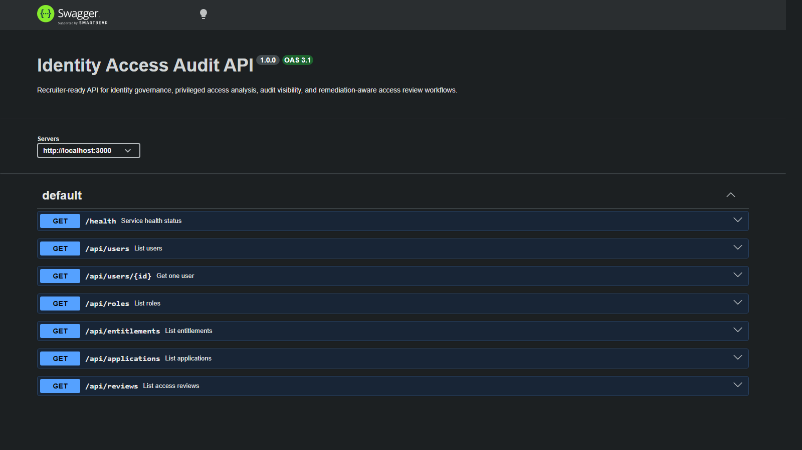
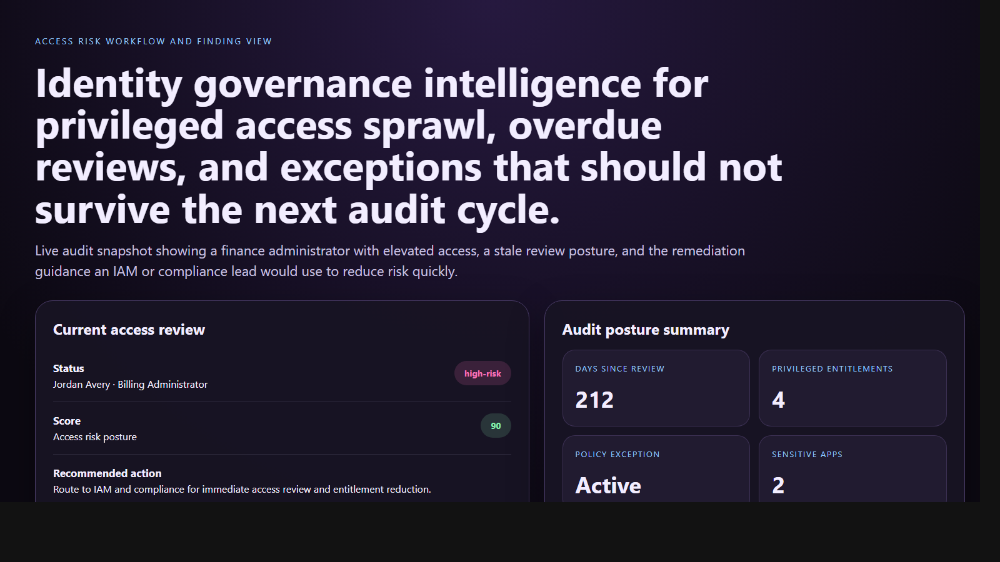
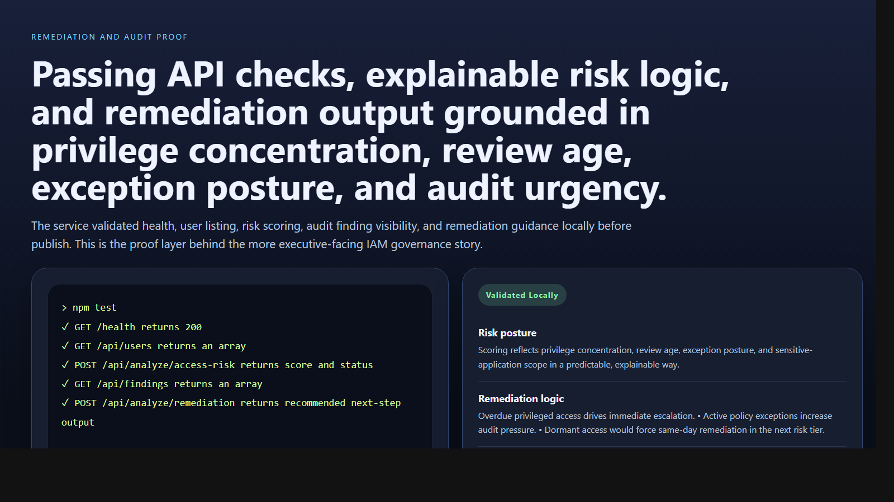

# Identity Access Audit API

> **TypeScript portfolio project** demonstrating identity governance, privileged access analysis, audit visibility, and remediation-oriented access review workflows for enterprise control systems.

**Recruiter takeaway:** *"This person understands identity governance and access review as operational decision systems, not static compliance paperwork."*

---

## Project Overview

| Attribute | Detail |
|---|---|
| **Runtime** | Node.js + TypeScript |
| **Framework** | Express 5 |
| **Domain** | IAM, access governance, audit operations |
| **Signal Areas** | Privileged entitlements · Review age · Policy exceptions · Dormant access · Sensitive applications |
| **Operational Outputs** | Risk posture · Exception review · Remediation priority |
| **Docs** | Swagger UI at `/docs` |

---

## Executive Summary

Identity Access Audit API models the kind of internal system IAM, security engineering, compliance, and platform teams use to assess access posture before small entitlement issues become real audit problems. Instead of acting like a toy authentication demo, the API focuses on governance: who has privileged access, which reviews are overdue, where policy exceptions are active, how dormant access should be prioritized, and what remediation step should happen next.

The result is a recruiter-facing backend project that feels like a realistic audit and control workflow service rather than a generic RBAC example.

---

## Business Problem

Identity risk often grows quietly inside overdue access reviews, privileged entitlement sprawl, policy exceptions that outlive their purpose, and dormant accounts that keep sensitive-system access longer than they should. Teams need more than a user list. They need an operational view of risk, urgency, and remediation posture.

---

## Solution

This API turns identity review posture into decision support. It models users, roles, entitlements, applications, policy exceptions, access-review events, and audit findings, then returns:

- access-risk scores
- exception review guidance
- remediation prioritization
- dashboard-level audit and governance summaries

---

## Architecture

```text
Access review or audit scenario
    |
    v
POST /api/analyze/*
    |
    +--> Request validation
    +--> Privilege and review-age analysis
    +--> Exception and dormant-access review
    +--> Sensitive-application exposure weighting
    |
    v
Risk posture
    |
    +--> low-risk
    +--> needs-review
    +--> high-risk
```

### Access Review Workflow

1. Teams submit an access-risk scenario or query current users, roles, reviews, and findings.
2. The service validates request shape with Zod.
3. Risk logic reviews privileged entitlement count, review recency, policy exceptions, dormant posture, and sensitive-application scope.
4. The service returns a score, issues, passed checks, and a recommended next action.
5. Operators use dashboard, findings, and review views to prioritize remediation and control evidence.

---

## API Endpoints

| Method | Endpoint | Purpose |
|---|---|---|
| `GET` | `/health` | Service status and uptime |
| `GET` | `/api/users` | List users |
| `GET` | `/api/users/:id` | Fetch one user |
| `GET` | `/api/roles` | List roles |
| `GET` | `/api/entitlements` | List entitlements |
| `GET` | `/api/applications` | List applications |
| `GET` | `/api/reviews` | List access reviews |
| `GET` | `/api/findings` | List audit findings |
| `GET` | `/api/dashboard/summary` | Audit operations summary |
| `POST` | `/api/analyze/access-risk` | Analyze access risk |
| `POST` | `/api/analyze/exception` | Analyze exception posture |
| `POST` | `/api/analyze/remediation` | Analyze remediation priority |

---

## Sample Access-Risk Request

```json
{
  "userName": "Jordan Avery",
  "department": "Finance Operations",
  "role": "Billing Administrator",
  "sensitiveApplications": ["ERP", "Revenue Reporting"],
  "privilegedEntitlements": 4,
  "daysSinceLastAccessReview": 212,
  "hasPolicyException": true,
  "isDormant": false
}
```

## Sample Access-Risk Response

```json
{
  "status": "high-risk",
  "score": 90,
  "issues": [
    "Privileged entitlement count exceeds standard role baseline.",
    "Access review is materially overdue.",
    "Policy exception is still active on sensitive applications.",
    "Multiple sensitive applications increase audit and privilege review priority."
  ],
  "passedChecks": [
    "User account is active and not currently dormant."
  ],
  "recommendedNextAction": "Route to IAM and compliance for immediate access review and entitlement reduction."
}
```

---

## Screenshots

### Hero Capture



### Access Risk Workflow and Finding View



### Remediation and Audit Proof



---

## Getting Started

### Prerequisites

- Node.js 20+
- npm

### Setup

```bash
git clone https://github.com/mizcausevic-dev/identity-access-audit-api.git
cd identity-access-audit-api
npm install
cp .env.example .env
npm run dev
```

Visit:

- `http://localhost:3000/docs`
- `http://localhost:3000/api/users`
- `http://localhost:3000/api/dashboard/summary`

### Run Tests

```bash
npm test
```

---

## What This Demonstrates

- identity governance translated into backend service logic
- audit and remediation thinking instead of static access listing
- privileged-access and exception-aware risk modeling
- dormant-account and review-age prioritization
- production-minded TypeScript API structure with docs, tests, and operational summaries

---

## Future Enhancements

- persist review history, exceptions, and findings in PostgreSQL
- integrate IdP and directory event ingestion
- add SoD conflict rules and peer-access baselines
- support certification campaigns and reviewer attestations
- generate exportable audit evidence and remediation aging reports

---

## Tech Stack


### Portfolio Links

- [LinkedIn](https://www.linkedin.com/in/mirzacausevic)
- [Skills Page](https://mizcausevic.com/skills/)
- [Medium](https://medium.com/@mizcausevic)
- [GitHub](https://github.com/mizcausevic-dev)

---

*Part of [mizcausevic-dev's GitHub portfolio](https://github.com/mizcausevic-dev) — demonstrating identity governance, audit-aware backend design, and remediation-focused access review systems.*
